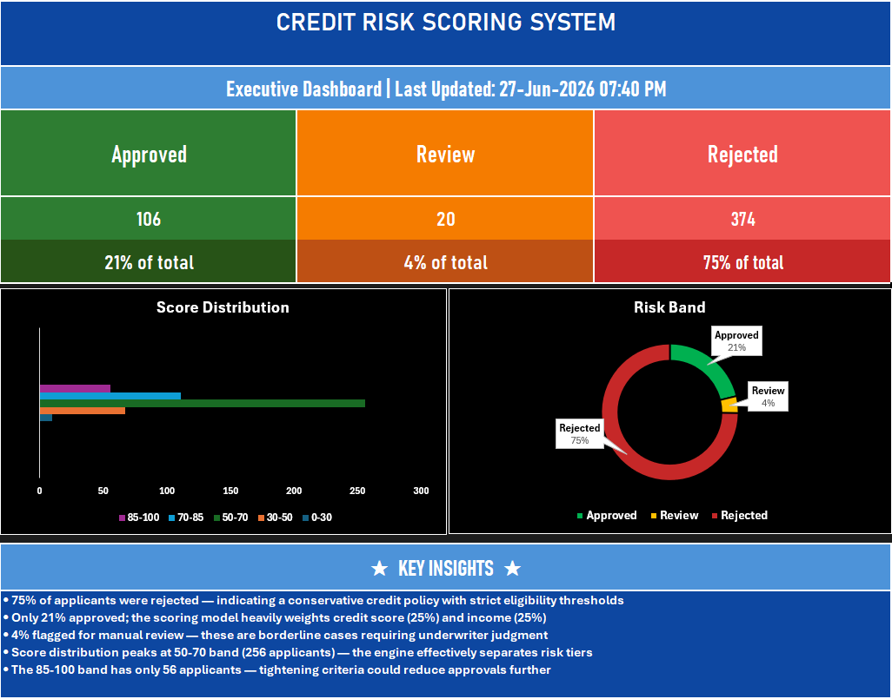
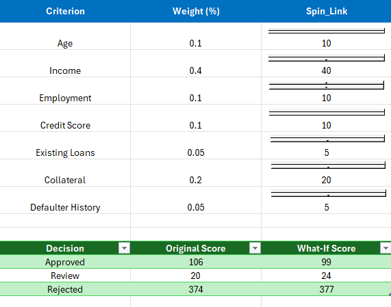
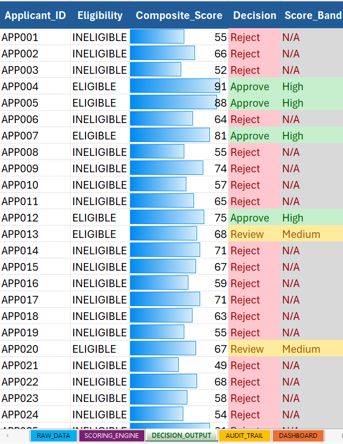
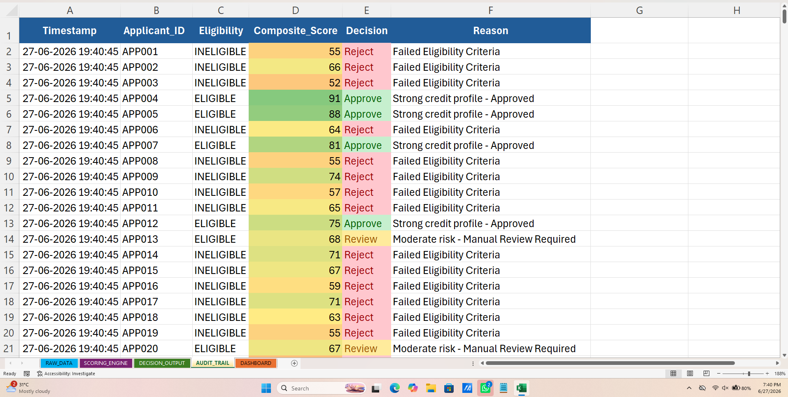

# 🏦 Credit Risk Scoring System

**End-to-end rule-based credit risk decision engine built in Excel. Weighted scoring, LAMBDA classification, VBA automation, audit trail, and what-if modeling.**

---

## 📊 Project Overview

Evaluates 500 synthetic loan applicants through a 3-layer pipeline:
- **Eligibility Screening** → 5 business rules
- **Weighted Scoring** → 7 criteria, 0–100 composite
- **Decision Classification** → LAMBDA + LET: Approve / Review / Reject

| Result | Count | % |
|--------|-------|---|
| Approved | 106 | 21% |
| Review | 20 | 4% |
| Rejected | 374 | 75% |

---

## 🛠 Tech Stack

| Layer | Tools |
|-------|-------|
| Core Engine | Excel (LAMBDA, LET, Dynamic Arrays, SUMPRODUCT, IF/AND/OR) |
| Automation | VBA Macros (One-click engine, Audit log, Error handling) |
| Dashboard | Dark theme, KPI cards, Score distribution chart, Donut chart |
| What-If | Spin buttons, Weight comparison table |
| Version Control | Git + GitHub |

---

## 📁 Sheets

| Sheet | Purpose |
|-------|---------|
| RAW_DATA | 500 applicants × 12 criteria |
| SCORING_ENGINE | Eligibility checks + Weighted scoring + What-If panel |
| DECISION_OUTPUT | LAMBDA classification + Dynamic filtered lists |
| AUDIT_TRAIL | VBA-generated log with timestamps + reasons |
| DASHBOARD | Executive KPI cards, charts, insights |

---

## 📅 Build Timeline (14 Days)

### Phase 1 — Intelligence Layer
- Day 1 — Project setup, 500 applicant dataset
- Day 2 — Eligibility criteria (nested IF/AND, rejection reasons)
- Day 3 — Weighted scoring engine (7 criteria, 0–100)
- Day 4 — LAMBDA + LET classification (CLASSIFY_CREDIT)
- Day 5 — Dynamic arrays (FILTER, SORT)
- Day 6 — Audit trail (formula layer)
- Day 7 — Phase 1 stress test + validation

### Phase 2 — Automation + Dashboard
- Day 8 — VBA audit log writer (static timestamps)
- Day 9 — One-click automation macro + button
- Day 10 — Error handling + data validation layer
- Day 11 — Executive dashboard (dark theme, KPI, charts, insights)
- Day 12 — What-if panel (spin buttons, weight comparison)
- Day 13 — Conditional formatting intelligence
- Day 14 — Polish, screenshots, portfolio pack

---

## 🚀 Key Features

- **Cognitive Rule Engine** — Transparent, auditable decision logic
- **One-Click Automation** — Refresh → Score → Classify → Audit Log → Save
- **Audit Trail** — Timestamped log with reason strings (regulatory-ready)
- **What-If Modeling** — Adjust scoring weights live, compare outcomes
- **Professional Dashboard** — Dark theme, KPI cards, color-coded charts
- **Error Handling** — Input validation, user-friendly alerts

---

## 📸 Screenshots

---

## 🔮 Future Upgrades

- Logistic Regression benchmark (Python)
- Power Query for automated data loading
- Model comparison (Rule Engine vs Statistical Model)

---

## 👤 Built By

**Asawari Fuse**